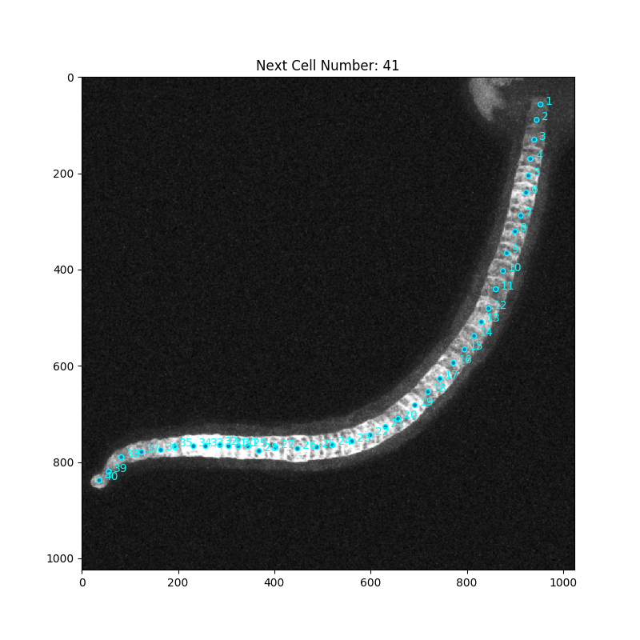
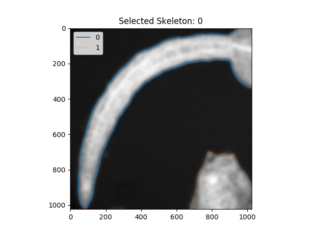
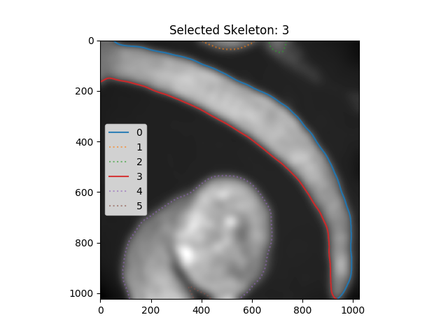

# Click Notochord Cells
A python application to annotate Notochord cell locations. This application was written to be used internally in our lab, but if anyone finds a use for interactive matplotlib code, feel free to use and alter it it to your liking.

### Getting started

```
import SelectApp
SelectApp(path = "/path/to/tiff/files")
```
Then enter <kbd>n</kbd> for Notochord-clicking mode and <kbd>c</kbd> for contour finding mode.

or run

```
python3 SelectApp.py
```
although on some installations this results in an event-loop error.

### controls for Cell Selecting
* `left click` adds a location.
* `right click` removes a location.
* <kbd>enter</kbd> saves the results to ./cell_locations/{filename}/ where it will place the image as a png and the locations as a tab-delimited textfile.
* <kbd>left</kbd> and <kbd>right</kbd> open next/previous images from the loaded list.
* <kbd>+</kbd> and <kbd>-</kbd> increment and decrement the cell number so that you can skip numbers you are unsure about and annotate the cells with exactly the numbers you want.
* <kbd>1</kbd> applies a gaussian filter on the image.
* <kbd>2</kbd> adjusts the gamma with gamma=0.9.
* <kbd>3</kbd> adjuts the gamma with gamma=1.1.
* <kbd>r</kbd> resets all results and editing for the current image.




### controls for Contour Selecting
* 'left click' adds a contour to selection.
* 'right click' removes a contour from selection.
* 'middle click' adds a marker to a skeleton indicating where it will be cut if this is the only selected contour.
* <kbd>left</kbd> and <kbd>right</kbd> open next/previous images from the loaded list.
* <kbd>1</kbd> applies a generous gaussian filter.
* <kbd>2</kbd> adjusts the gamma with gamma = 0.2.
* <kbd>3</kbd> adjusts the gamma with gamma = 1.5.
* <kbd>c</kbd> attempts to find contours in the image.
* <kbd>x</kbd> shows the contours that van be saved at the current timepoint.
* <kbd>enter</kbd> saves the results.
* <kbd>r</kbd> resets all results and editing for the current image.

For contour finding, blur the image and adjust the gamma to ensure smooth outlines. The contour finding will threshold the image behind the scenes and return the contours found in the thresholded image. Select the top and bottom contour of the animal, or if there is only one contour around the whole animal, select that contour and place a cut mark at the tail tip. 
| --- | --- |
|  |  |
